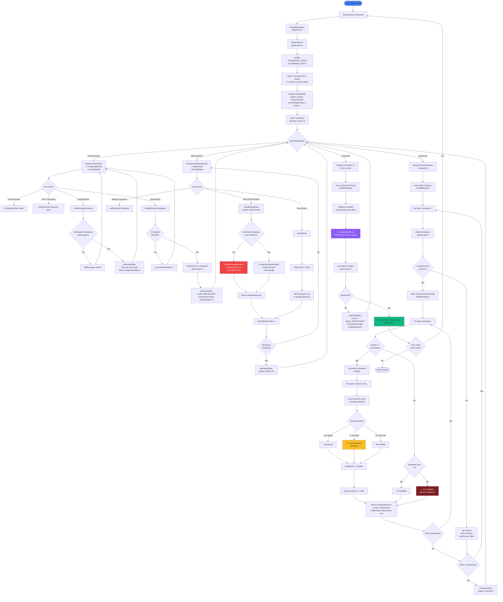

# Signal to Noise - Game Flowcharts

## 1. Player Perspective Flowchart

How players experience the game from start to finish.

```mermaid
flowchart TD
    Start([Game Start: 2-4 Players]) --> Setup[Each player gets 3 evidence cards]
    Setup --> Round{Start Round}

    Round --> Investigate[INVESTIGATE PHASE]

    Investigate --> YourTurn{Your Turn?}
    YourTurn -->|No| Wait1[Wait for other players]
    Wait1 --> YourTurn
    YourTurn -->|Yes| SelectCard[Look at your evidence hand]

    SelectCard --> HasCards{Have cards?}
    HasCards -->|No| DoneInv[Click 'Done Investigating']
    HasCards -->|Yes| PickCard[Click evidence card]
    PickCard --> PickConsp[Click conspiracy to assign to]
    PickConsp --> ValidAssign{Card supports<br/>conspiracy?}
    ValidAssign -->|No| Error1[❌ Invalid - try again]
    Error1 --> PickCard
    ValidAssign -->|Yes| Assigned[Card assigned!<br/>Removed from hand]
    Assigned --> MoreCards{Want to assign<br/>more cards?}
    MoreCards -->|Yes| PickCard
    MoreCards -->|No| DoneInv

    DoneInv --> AllDone{All players<br/>finished?}
    AllDone -->|No| Wait2[Next player's turn]
    Wait2 --> YourTurn
    AllDone -->|Yes| DrawCards[Everyone draws 2 cards]

    DrawCards --> Broadcast[BROADCAST PHASE]

    Broadcast --> TurnOrder[🎯 Losing player goes first!]
    TurnOrder --> BroadTurn{Your Turn?}
    BroadTurn -->|No| Wait3[Watch what others claim<br/>Track consensus votes]
    Wait3 --> BroadTurn
    BroadTurn -->|Yes| SeeQueue[Check Broadcast Queue<br/>See what others claimed]

    SeeQueue --> Decision{What do you do?}

    Decision -->|Pass| PassAction[Pass & Draw 1 Card<br/>Skip this round]
    PassAction --> NextPlayer1

    Decision -->|Broadcast| CheckEvidence{Have evidence<br/>assigned?}
    CheckEvidence -->|Yes| SafeBroadcast[Select conspiracy<br/>Choose REAL or FAKE]
    CheckEvidence -->|No| BluffWarning[⚠️ BLUFFING!<br/>No evidence = risky]
    BluffWarning --> RiskyBroadcast[Select conspiracy anyway<br/>Choose REAL or FAKE]

    SafeBroadcast --> BroadcastMade[Broadcast added to queue]
    RiskyBroadcast --> BroadcastMade
    BroadcastMade --> NextPlayer1[Next player's turn]

    NextPlayer1 --> AllBroadcast{All players<br/>went?}
    AllBroadcast -->|No| BroadTurn
    AllBroadcast -->|Yes| Resolve[RESOLVE PHASE]

    Resolve --> CheckConsp[For each conspiracy with broadcasts...]
    CheckConsp --> ConsensusCheck{Consensus<br/>reached?}

    ConsensusCheck -->|No 2p: Need 2 votes<br/>3-4p: Need 3 votes| NoConsensus[❌ NO CONSENSUS<br/>All broadcasts discarded<br/>No scoring]

    ConsensusCheck -->|Yes| RevealTruth[🎲 Truth Revealed!<br/>Conspiracy flipped]
    RevealTruth --> ScorePlayers[Score each broadcaster...]

    ScorePlayers --> WasCorrect{Claimed<br/>correctly?}

    WasCorrect -->|Yes| HadEvidence{Had evidence<br/>assigned?}
    HadEvidence -->|Yes| CalcExcitement[Calculate excitement modifier]
    CalcExcitement --> SafeWin[✅ +Points = Evidence × Tier ± Excitement]

    HadEvidence -->|No| BluffSuccess[🎰 BLUFF SUCCESS!<br/>Lucky guess!]
    BluffSuccess --> SafeWin

    WasCorrect -->|No| HadEvidence2{Had evidence<br/>assigned?}
    HadEvidence2 -->|Yes| NormalLoss[❌ Wrong: -3 Credibility]
    HadEvidence2 -->|No| BluffFail[💀 BLUFF FAILED!<br/>-6 Credibility DOUBLE PENALTY]

    SafeWin --> NextConsp
    NormalLoss --> NextConsp
    BluffFail --> NextConsp
    NoConsensus --> NextConsp

    NextConsp{More conspiracies<br/>to resolve?}
    NextConsp -->|Yes| CheckConsp
    NextConsp -->|No| ShowResults[Display Round Results<br/>Excitement bonuses/penalties shown]

    ShowResults --> Cleanup[CLEANUP PHASE]

    Cleanup --> ReplaceConsp[Replace revealed conspiracies]
    Cleanup --> KeepEvidence[⚡ Evidence STAYS assigned!<br/>Reuse for bonuses/penalties]
    KeepEvidence --> WinCheck{Game Over?}

    WinCheck -->|60+ Audience| Winner
    WinCheck -->|12 Revealed| Winner
    WinCheck -->|6 Rounds Done| Winner
    WinCheck -->|No| NextRound[Next Round]
    NextRound --> Round

    Winner([🏆 Winner: Highest Audience!])

    style Start fill:#3b82f6
    style Winner fill:#10b981
    style BluffWarning fill:#ef4444,color:#fff
    style BluffFail fill:#7f1d1d,color:#fff
    style BluffSuccess fill:#fbbf24
    style SafeWin fill:#10b981
    style NoConsensus fill:#f59e0b
    style RevealTruth fill:#8b5cf6,color:#fff
```



## 2. Software Engineering Flowchart

How the application manages state and processes game logic.



## Key Technical Notes

### State Management Flow
1. **GameState** (App.tsx) - Single source of truth
2. **Phase transitions** - Controlled by user actions (buttons)
3. **Player rotation** - Dynamic based on audience scores
4. **Persistence** - Evidence assignments survive CLEANUP

### Bluffing Implementation
- **Detection**: `evidenceCount === 0` on BroadcastObject
- **Penalty**: Double credibility loss (-6 instead of -3)
- **No reward bonus**: Bluff success = normal points (no extra)

### Excitement Mechanic
- **Tracked via**: `player.broadcastHistory[]`
- **Applied at**: RESOLVE phase scoring
- **Calculation**: Check previous uses → apply modifier → stack bonuses

### Consensus Algorithm
```javascript
// From gameLogic.ts
threshold = playerCount === 2 ? 2 : 3
realCount >= threshold → consensus: REAL
fakeCount >= threshold → consensus: FAKE
else → no consensus
```

### Turn Order Logic
```javascript
// Losing player advantage
startingPlayerIndex = players.reduce((lowestIdx, player, idx, arr) =>
  player.audience < arr[lowestIdx].audience ? idx : lowestIdx
, 0)
```
